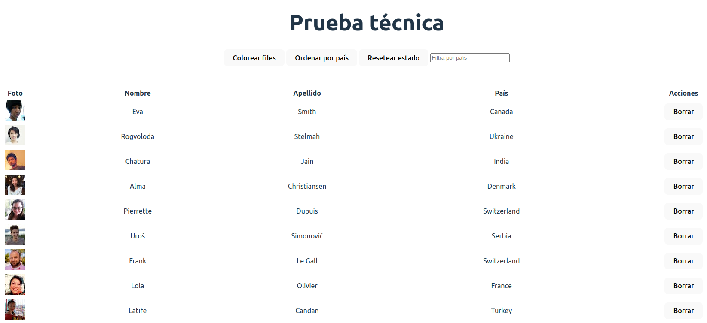

# Users table.🦸👨‍🚀 👨‍💼
El objetivo de esta prueba técnica es crear una aplicación similar a : 

Para lograr esto, debe usar la API proporcionada por https://randomuser.me/.

Los pasos a seguir:

- [x] Fetch 100 rows of data using the API.
- [x] Display the data in a table format, similar to the example.
- [x] Provide the option to color rows as shown in the example.
- [x] Allow the data to be sorted by country as demonstrated in the example.
- [x] Enable the ability to delete a row as shown in the example.
- [x] Implement a feature that allows the user to restore the initial state, meaning that all deleted rows will be recovered.
- [x] Handle any potential errors that may occur.
- [x] Implement a feature that allows the user to filter the data by country.
- [x] Avoid sorting users again the data when the user is changing filter by country.
- [x] Sort by clicking on the column header.

1. Nunca tipar a mano googlear "generate typescript from json". y obtener la interface ingresando el json https://app.quicktype.io/ . pegarle todo el json siempre completo. 
2. UseState recuerda tiparlo:   const [users, setUsers] = useState<User[]>([])
3. table no estan deprecadas, nunca decir esas cosas la clave?   
  1. table, thead, tboby, tr (row),  td (cell)  
4. Al trabajar con typescript NO DEJAR ningun error de tipos. (es mejor any que error 😑).
5. Ante el error: **"react-dom_client.js?v=b30e49ed:519 Warning: Encountered two children with the same key, ``. Keys should be unique so"**
  1. NO desesperar basicamente te dice que las keys deben ser unicas y estas usando una key que no lo es, 
    podes probar usando el index si estba usando un "id" que resulto que no es unico.
6. Use effect dos maneras de uso: 
  1. podemos setear el estado usando algo como:     setShowColors(!showColors) siempre y cuando no necesitamos mas el viej estado.
  2. Si necesitamos tanto el estado viejo como el nuevo, el useState puede recibir un callback donde tiene 
  como argumento el estado viejo: 
    ```js  
      setSortByCountry( (statePrev) => { 
      const stateNew = !statePrev
      // trabajo aca con el viejo o el nuevo estado pim pum 📄
      return stateNew } )
    ```  
1. Ordenar strings como hacemos ? no debemos hacer algo asi : 
    ```const sortUser = users.sort( (a, b) => { return a.location.country > b.location.country ? 1: -1  }  ```
    porque no esta considerando caracteres no ASCII como è, à, ò y demas => usar el localCompare. 
 2. ```  const sortUser = users.sort( (a,b) => { return a.location.country.localeCompare(b.location.country) }) ``` 
 3. Si hacemos a y luego b lo hacemos de forma ascendente y alrevez de forma descendente. 
2. en el operador ? ya esta implicito el return: 
  ``` sortByCountry ? users.sort( (a,b) => {
     return a.location.country.localeCompare(b.location.country)
    }) : users
  ```  
1. Pero si lo probamos directamente asi no al hacer denuevo en no orenar no regresa al estado incial,
    porque modificamos la original, solucion => hacer una copiar de la original y devolver la copia ordenada.
  1. Solucion 1 (usando spread operator) para obtener una copia de user y ordenar esa: (nota: 7) 
    ```const sortedUser = sortByCountry ? [... users].sort( (a,b) => {...} ```
  2. Solucion 2 usando el structuredClone(): (copia profundo bajas la perfomance) (nota: 5)  
    ```const sortedUser = sortByCountry ? structuredClone(users).sort( (a,b) => {...} ```
  3. Solucion 3: usando ultima feature de js toSorted (Nota: 10)  
    ```const sortedUser = sortByCountry ? users.toSorted( (a,b) => {...} ```
  4. Vemos que al usar el ultimo feature nos tira warning de que toSorted no es propiedad de users. 
  5. se arregla declarando la firma del toSorted en type.d.ts.     
2. Un error seria tener otro estado para ordenar los users, mal solo se necesita un estado de users.
3. al usar el indice para borrar, aparecne usuarios que no deberian aparecer, se vuelve a reutilizar la misma
   key que tenia antes. 
4. Al borrar un usuario usando su indice y lo usamos como key, al modificar el array y los indices que tiene
  usarlo de key, si por ejemplo borramos el elemento con indice 2 el elemento con posicion:3 pasa a ser el 2
  y esto es un problema porque react cree que el 2 era el otro. -> usar una key unica corolario.
1. Si vas a sacar/agregar filas no tenes que usar el indice.
2. Hacer otro useState para backup los userOriginal es inncesario, otra es usar una variable global. let con 
   la lista orginal de usuario, podria funcionar porque se crea solo una unica vez el componente pero si se 
   crean muchos mas, el valor de esta variable se compartiria con todos los componentes no es la forma
   correcta.
  1. Estados estan pensandos para que cada vez que cambien se vuelva a renderizar la UI. 
  2. La forma correcta es hacer uso de useRef() -> para guardar un valor que se comparte entre renderizados
     y que al cambiar este valor, no se renderiza el componente. 
  3. Es como el useState pero con 2 diferencias:
     1. cada vez que cambia el ref no renderiza el componente
     2. Para acceder al valor de una referencia y cambiarla debemos acceder al .current. 
  4. Preserva el valor que lo guardamos entre renderizados, SE Puede guardar un elemento y no solo
     elementos del DOM. 
3. Primero filtramos usuarios y luego los ordenamos, no tiene sentido hacerlo al revez, porque
   no tiene sentido ordenar usuarios que no hemos filtrado.
4. Haciendo un refactor y Vemos que se esta renderizado el componente independiente si los resultados
   son exactamente los mismos o no, cambiar el color tambien ordenad denuevo y es ineficiente. 
5. Tenemos que hacer uso de useMemo para poder evitar esos ordenamiento inncesarios.
6. Con useMemo memorizar el valor y cuando se renderizar el componente al cambiar algun useState evitamos
   volver a crear funciones (y volver a ordenar como antes)
7. Al darle a colorear, cambia el estado y se renderiza todo el componente pero cuando llega a los useMemeo, se fija el array
   de depdendencia, como no cambio ningun, recupera el valor anterior me salto y doy el valor q tenia.
8. Haciendo con css truco pa pintar pares e impares (Css -> indices arrancan en 1 y no en 0 ): podemos hacerlo con odd y even tambien. 
    ```css
    .table--showColors tr:nth-child(2n)  {
      background-color: #432b6a;
    }

    .table--showColors tr:nth-child(2n+1)  {
      background-color: #7d65b6;
    }
    ```
9. En lugar de hace suceviso if, elif, podriamos hacer un record (Diccionario en typescript) una forma de tipar el objeto. 
## Nuevas mejoras 🪄 🤯
1. Podemos concadenar las promesas  con un finaly, que se ejecuta siempre, despues de que se haya resuelto con exito, o que haya
   capturado una excepcion se ejecuta el bloque del finally. 
2. Para saber si ha fallado el fetch o no recuerda: hacer un if(!res.ok) y podemos printear el trio: res.ok, res.status, res.statusText 
### Paginacion 🤯 📃 📃
1. Cada vez al obtener mas resultados estamos pisando los anteriores y no estamos acumulando todos los resultados, lo fixeamos viendo el fetch. 
2. Concadenamos los resultados ``` .then( (res) => { setUsers( (prevUsers) => { return prevUsers.concat(res.results) } );``` 
3. Desmontar un componente y volverlo a cambiar ? -> error muy tipico, ver que los states loading y error cambian el estado y por lo tanto el 
   userLists pasa a ser desomontando y vuelve a ser montado (por el and &&). 
4. Desmontar un componente tiene un impacto en la UX, y tambien en el rendimiento.
5. Usando f12->network in No throttling podemos modificar la velocidad del internet (Fast, slowed) 🤯❗
6. Mostrar mas resultado y hacerlo sin boton, no recomiendo la ux es rara, lo hacemos con un hook useIntersectionServer. 
7. Al refactorizar fetchs, desacoplar la logica de lo setStates de los que escupa el res.result de una y donde lo invoquemos usemos por ej el "users". 
## TanStack Query (React Query)
1. Es una forma de manejar estados asincronos que funciona en react, solid, esvelt, typescript, js.
2. otras alternativas: Redux query, SWR, etc. 
3. Una biblioteca para hacer fetching de datos ? -> ❌ NO!., podrias no hacer ningun fetching, es para manejar/administracion de estados asincronos. 
4. npm install @tanstack/react-query -E.  
5. Como tiene un estado global va a tener que usar un contexto y por lo tanto necesitamos un provider. 
6. Los provider lo que hacen es que lo que envuelven le inyecta un contexto para acceder a los componentes, creamos el provider y le agregamos como 
   prop el queryClient 
7. importamos el useQuery en app.tsx y este recibe 2 argumentos:
   1. La key: es un array de donde le podemos pasar cualquier cosa para poder identificar la query, porque las query se catchean y ademas te la mantienen
      en un estado global, usamos la id para luego recueprar la ifnroamcion. 
   2. una funcion, para indicarle como recuperar la informacion,   
8. Del useQuery podemos sacar todo tipo de informacion isLoading, isError, data.   
9. refetch() -> vuelve a pedir los datos que le pedimos antes.
### Infinite Scroll
1. para modelar los infinte scrools, casi todas las api me dicen en que pagina esta y si todavia tiene resultados ,etc. 
2. UseQuery no esta pensando para hacer este tipo de paginacion infinita para eso tenes el. useInfiniteQuery, parece igual pero no lo es.  
3. fetchNextPage: para que haga un fetch directamnte de la proxima pagina, hasNextPage, para ver si tiene una nueva pagina. 
4. podemos agregar otro objeto al useInfiniteQuery, para ver cada tanto tiempo hacer un refetch, de donde saca el nextParam, 
5. last page: ultima rspt que hemos cargado. 
6. console.log(void 2 ) -> escupe undefined. y no retorna 2. 
7. 
